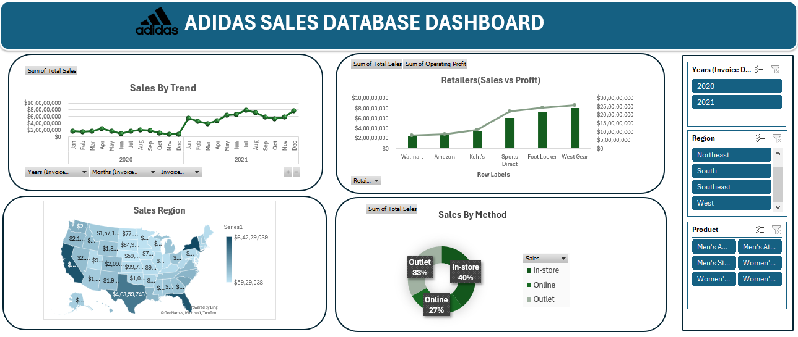

Adidas Sales Database Dashboard - README
This project showcases an interactive Adidas Sales Dashboard created using Microsoft Excel. The dashboard provides insights into sales trends, regional performance, retailer profit analysis, and sales methods using charts, maps, slicers, and KPIs.
Project Overview
•	Interactive dashboard built in Microsoft Excel 

•	Analyzes Adidas sales performance data 

•	Uses charts, maps, and slicers for filtering

•	Provides business insights for decision-making Dashboard Features

•	Sales Trend Analysis (2020–2021)

•	Retailer Sales vs Operating Profit Comparison

•	Region-wise Sales Visualization

•	Sales Method Distribution (Online, In-store, Outlet)

•	Interactive Slicers for Year, Region, and Product Filtering Tools & Technologies Used

•	Microsoft Excel

•	Pivot Tables

•	Pivot Charts

•	Slicers

•	Conditional Formatting

•	Bing Maps Integration

Dashboard Screenshot
   
 
 For a detailed overview and project presentation, check out my LinkedIn post: https://www.linkedin.com/posts/sushant-shilimkar-24b7a2351_dataanalytics-exceldashboard-datavisualization-ugcPost-7447492700100239360-Zsi6/?utm_source=share&utm_medium=member_desktop&rcm=ACoAAFfcHNsBkJ6rTmHkURe8Ai39maVXQfkeihE